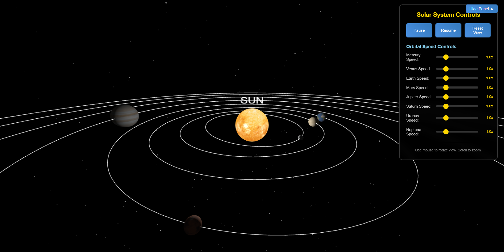

# 3D Solar System Simulation

This is an interactive, animated 3D simulation of the Solar System built with Three.js. Each planet orbits the sun with realistic speeds, distances, and textures. Includes speed controls, camera rotation, zoom, and labels.

## 🌌 Features

- 3D planets with textures and orbits
- Real-time speed control for each planet
- Zoom, rotate, and pan camera using mouse
- Floating labels appear on hover
- Reset, pause, and resume controls
- Starfield background
- Realistic elliptical orbits and revolution

## 🖥️ Demo Preview



---

## 📁 Folder Structure

```
project-root/
│
├── index.html # Main HTML structure
├── styles.css # CSS styles for UI & layout
├── scripts.js # JavaScript logic (Three.js setup, animation)
└── textures/ # Planet texture images (sun.jpg, earth.jpg, etc.)
```

---

## 🚀 How to Run the Project

You must run this project from a local server to avoid browser restrictions when loading textures.

### ✅ Option 1: Using `npx serve` (Recommended)

1. **Install Node.js** from: https://nodejs.org  
2. Open a terminal in the project folder.
3. Run the command:

```bash
npx serve
```

4. Open the URL shown in terminal (usually `http://localhost:3000`).

---

### 🔄 Option 2: Using VSCode Live Server Extension

1. Install **Visual Studio Code** from https://code.visualstudio.com  
2. Install the **Live Server** extension in VSCode.
3. Open this project folder in VSCode.
4. Right-click `index.html` → choose **"Open with Live Server"**.

---

### ⚠️ Option 3: Open `index.html` Directly (not recommended)

1. Double-click `index.html` to open in your browser.
2. This may **not load textures** due to CORS/browser restrictions.
3. Use a local server instead (Option 1, 2, or 4).

---

### 🐍 Option 4: Using Python Local Server

1. **Install Python** from https://www.python.org  
2. In the terminal, navigate to the project directory.
3. Run the following command:

```bash
# Python 3
python -m http.server
```

4. Open your browser and go to:  
   `http://localhost:8000`

---

## 📦 Dependencies

Only **Three.js** is required, and it's loaded via CDN:

```html
<script src="https://cdn.jsdelivr.net/npm/three@0.158.0/build/three.min.js"></script>
```

No installations or build tools required.

---

## 🌍 Textures Used

Planet and sun textures were sourced from:

🔗 [https://www.solarsystemscope.com/textures/](https://www.solarsystemscope.com/textures/)

These public-domain textures provide realistic appearances of celestial bodies.

Make sure the `textures/` folder contains the following files:

```
textures/
├── sun.jpg
├── mercury.jpg
├── venus.jpg
├── earth.jpg
├── mars.jpg
├── jupiter.jpg
├── saturn.jpg
├── uranus.jpg
└── neptune.jpg
```

File names must match those referenced in `scripts.js`.

---

## 🎮 Controls

- **Mouse Drag** – Rotate the view
- **Scroll Wheel** – Zoom in/out
- **Sliders** – Adjust individual planet speeds
- **Pause** – Stop planet motion
- **Resume** – Resume planet motion
- **Reset View** – Reset camera angle and planet speeds
- **Hover** – Display floating labels of planet names

---

## 👨‍💻 Credits

- Developed using [Three.js](https://threejs.org)
- Textures from [SolarSystemScope Textures](https://www.solarsystemscope.com/textures/)